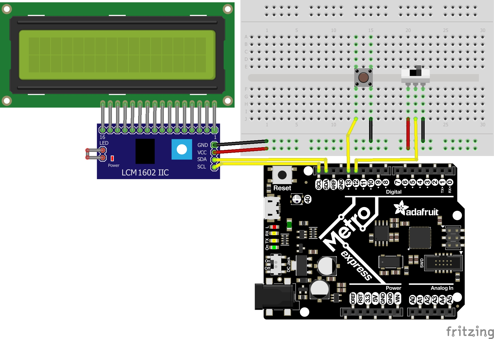
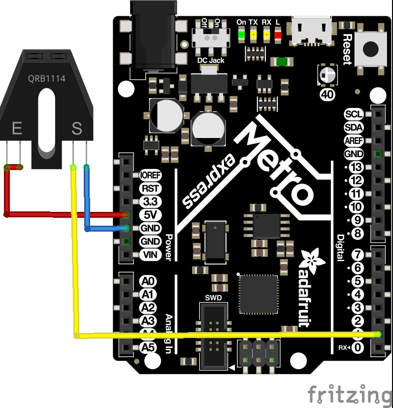

# Projects
Here are all the projects I've done so far. I'm probably working on one now!:squirrel:  Check the code for comments and more detailed descriptions of solutions.
## [Fade](/CircuitPython/blob/fade.py)
This project was relatively staightforward, only requiring that we get an led to fade on and off. The difficulty came in using a different language and editor than normal. Also, duty cycles were completely new and took me a little bit to grasp. The only wiring this project needed was one led.
 
## [Servo](/CircuitPython/blob/servo.py)
This project was also fairly straight forward for me. The goal was to have a servo that can be controlled with two wires using capacitive touch. Using pulseio for pwm also took me a bit, but I got the servos working and also got the capacitive touch working. You can control the servo just by grabbing the end of a wire. Cool!
 
## [LCD screen](/CircuitPython/blob/lcdcount.py)
I had a bit of trouble with this one. The goal was to make the screen display a number that would count up if a switch was one way and down if it was the other. I had trouble clearing the screen after the number increased or decreased. This meant that I would have left over negative signs or zeros that shouldn't have been there. The problem turned out to be that I wasn't printing enough spaces.
 
## [Distance Sensor](/CircuitPython/blob/ultrasoniccolor.py)
I had a tough time with this one. The goal was to have the metro's onboard led change color according to the distance an ultrasonic sensor was reading. I decided to use hue, saturation, value instead of RGB and it took me a while to find a suitable library. After that I needed some functions that I didn't have and needed to make myself. Another problem I had was that the colors were opposite to what I wanted, for example, I wanted it red when it was close and green when it was far away, but it was the opposite. All I had to do was switch the distance values inside my map function.
 
## [Photointerrupter](/CircuitPython/blob/photointerrupt.py)
I got through this one pretty fast. The goal was to use the interrupter to count the number of times it had been interrupted and print it to the serial monitor every four seconds without using sleep(). I used time.time() to get the number of seconds since 1970, saved it, and then waited until the difference was four. I also used a toggle so it would count two interruptions each time. One thing to note about the wiring is that (+) and L are both connected to 5v, (-) is connected to ground and OUT is your data pin.
 
## [RGB Class](/CircuitPython/blob/rgb.py)
This one was tricky. The goal was to create a class with a few functions and make two different RGB leds make some pretty colors. The first mistake I made was I forgot that they were common cathode instead of common anode leds. That was an easy fix that took me a while to figure out. After that I was able to get it working pretty easily.
 
## [Fancy LED](/CircuitPython/blob/fancyLED.py)
This one wasn't too bad. The goal was to create class that makes leds light up in patterns. I was on this assignment and I couldn't figure out why none of my LEDs were turning on. The answer was that I forgot the .value after the led I wanted, something that is very basic for digitalio.
 